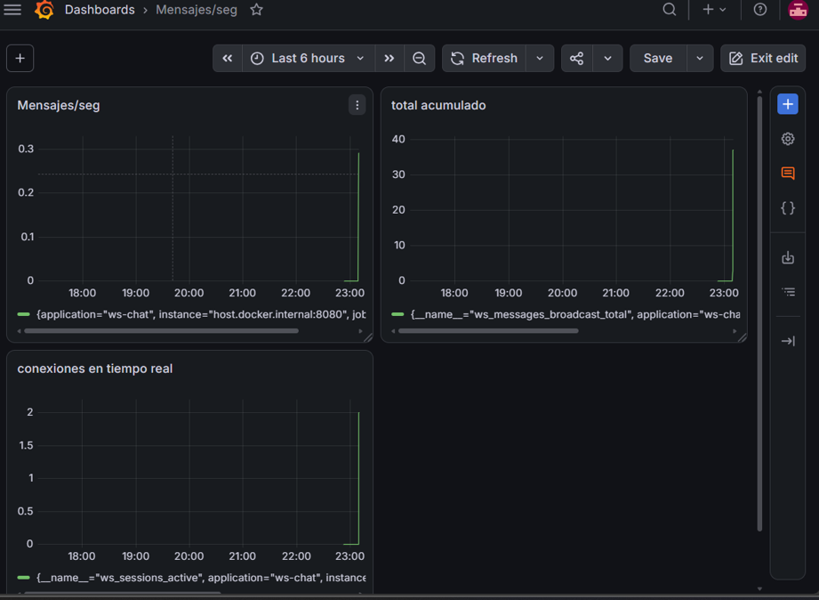
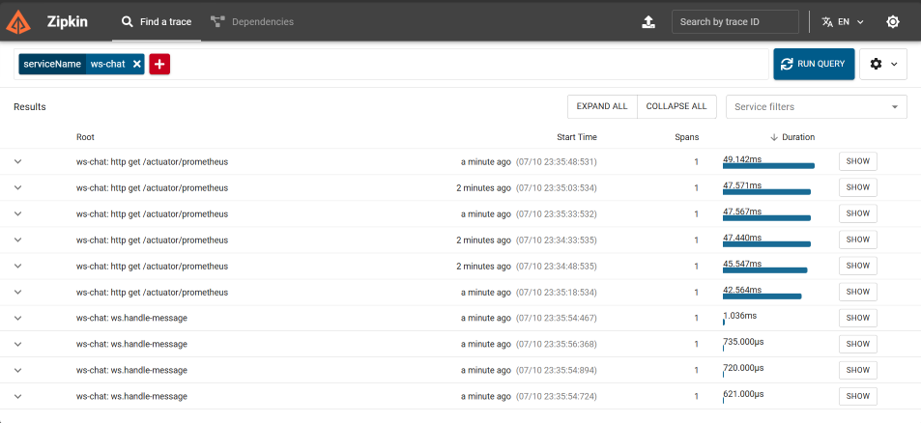
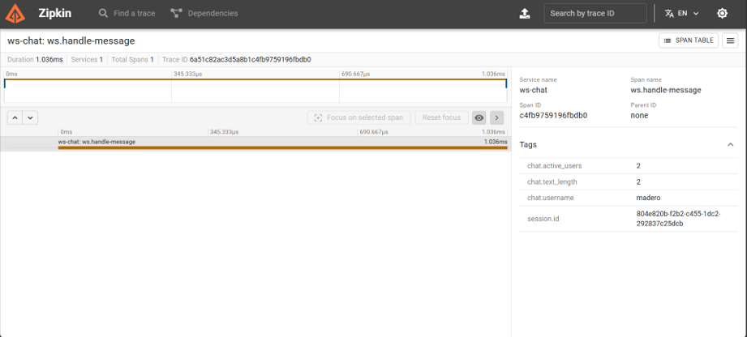
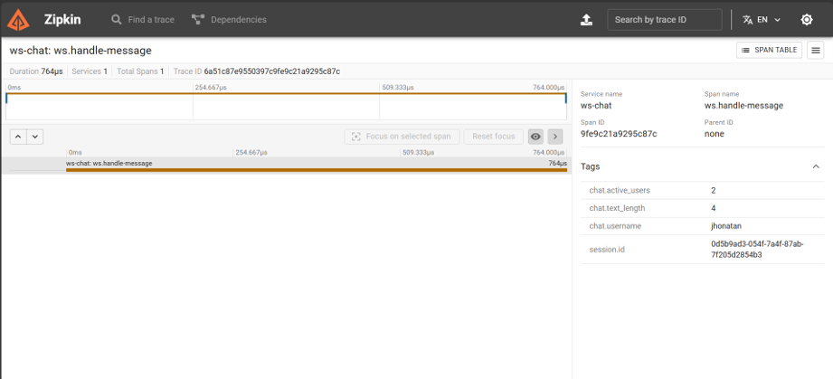
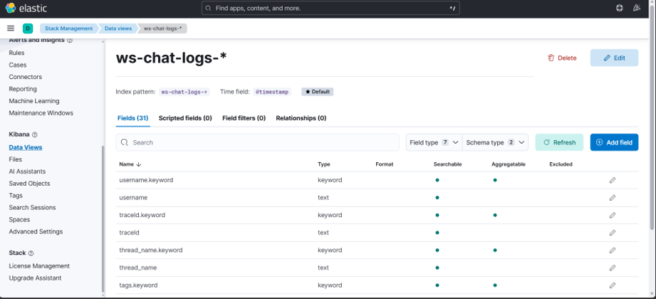
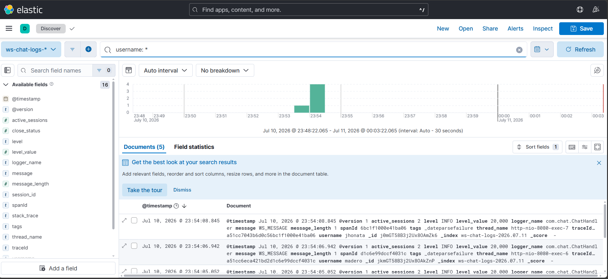

# ws-server

Servidor WebSocket para un chat en vivo, construido con Spring Boot puro (sin STOMP/SockJS).

## Stack

- Java 17 · Spring Boot 3.3.5 · `spring-boot-starter-websocket` · Jackson · Maven

## Funcionalidad

- Chat en tiempo real vía `ws://localhost:8080/chat`, con broadcast a todos los clientes conectados.
- Notifica conexión/desconexión de usuarios y el total de sesiones activas.
- Indicador de "usuario escribiendo...".

## Cómo correrlo

```bash
mvn spring-boot:run
```

## Observabilidad

Se agregó el stack completo de observabilidad sobre el servidor, siguiendo los tres pilares: métricas, trazas y logs.

```bash
docker compose up -d
```

Levanta Prometheus, Grafana, Zipkin, Elasticsearch, Logstash y Kibana (ver `docker-compose.yml`).

### Métricas — Grafana (`:3000`)

Contadores de mensajes recibidos/enviados y gauge de sesiones activas, expuestos en `/actuator/prometheus` y visualizados en un dashboard de Grafana.




### Trazas — Zipkin (`:9411`)

Cada mensaje genera un span (`ws.handle-message`) con tags de usuario, largo del mensaje y sesiones activas.






### Logs — Kibana (`:5601`)

Logs estructurados en JSON (vía Logback + Logstash), indexados en Elasticsearch como `ws-chat-logs-*`, correlacionados con las trazas mediante `traceId`.





## Proyecto relacionado

El cliente (React + Vite) vive en un repositorio separado: [`cliente`](https://github.com/jhonatanmadero/cliente).